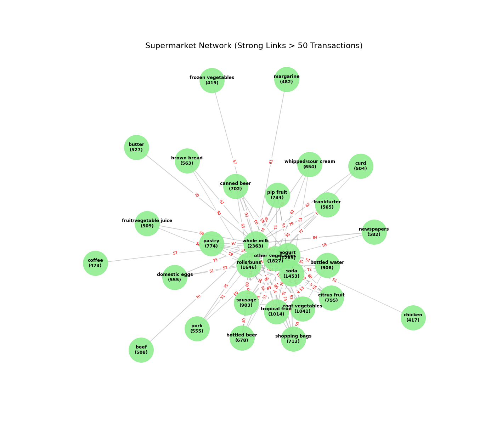
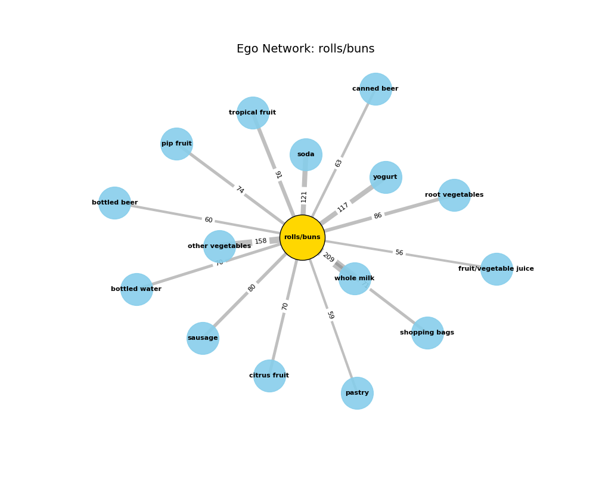

# Market Basket Analysis - Graph-Based Product Recommendations

A Python CLI tool that turns supermarket transactions into a weighted co-purchase graph to identify product bundles, cross-sell opportunities, and indirect item recommendations.

## Overview

This project analyses supermarket basket data by grouping raw purchase records into customer-date transactions, then modelling products as graph nodes and co-purchases as weighted edges. The analysis answers four questions:

| Question | Approach |
| --- | --- |
| Which products are bought together most often? | Weighted edge ranking with a custom Bubble Sort implementation |
| What is commonly bought with a selected product? | Adjacency-list lookup and ranking |
| Which products create useful cross-sell opportunities? | Confidence scoring, `P(partner | driver)`, with commodity-item filtering |
| Which less obvious products are indirectly related? | Breadth-First Search across two graph hops with hub filtering |

## Dataset

The repository includes `data/Supermarket_dataset_PAI.csv`, a transaction-level supermarket dataset with these fields:

| Field | Description |
| --- | --- |
| `Member_number` | Customer/member identifier |
| `Date` | Purchase date |
| `itemDescription` | Product purchased |

The loader groups rows by `(Member_number, Date)`, so each unique customer-date pair becomes one basket.

## Tech Stack

| Purpose | Tools |
| --- | --- |
| Data loading | Python `csv`, `collections.defaultdict` |
| Graph storage | Custom weighted adjacency-list graph |
| Algorithms | Bubble Sort, confidence scoring, Breadth-First Search |
| Visualisation | NetworkX, Matplotlib |
| Tests | Python `unittest` |

## Key Results

No predictive model metrics such as accuracy, precision, recall, F1, AUC, R2, or RMSE are present in this repository. The main results are graph-analysis metrics from the included transaction data.

| Metric | Result |
| --- | ---: |
| Raw purchase records | 38,765 |
| Grouped transactions | 14,963 |
| Unique products | 167 |
| Average basket size | 2.54 unique items |
| Highest-frequency item | `whole milk` - 2,363 baskets |
| Indirect niche recommendations for `yogurt` | 20 |

### Top Co-Purchase Pairs

| Rank | Product pair | Co-purchase count |
| ---: | --- | ---: |
| 1 | `other vegetables` + `whole milk` | 222 |
| 2 | `rolls/buns` + `whole milk` | 209 |
| 3 | `soda` + `whole milk` | 174 |
| 4 | `whole milk` + `yogurt` | 167 |
| 5 | `other vegetables` + `rolls/buns` | 158 |

### Example Associations for Yogurt

| Rank | Associated item | Co-purchase count |
| ---: | --- | ---: |
| 1 | `whole milk` | 167 |
| 2 | `other vegetables` | 121 |
| 3 | `rolls/buns` | 117 |
| 4 | `soda` | 87 |
| 5 | `sausage` | 86 |

### Strategic Cross-Sell Opportunities

The cross-sell analysis starts with high-volume product drivers, filters out common commodity targets, and ranks the strongest remaining partner by confidence.

| Driver | Suggested promotion target | Confidence |
| --- | --- | ---: |
| `yogurt` | `sausage` | 6.7% |
| `soda` | `sausage` | 6.1% |
| `whole milk` | `sausage` | 5.7% |
| `rolls/buns` | `tropical fruit` | 5.5% |
| `other vegetables` | `tropical fruit` | 5.1% |

## Visual Outputs

Running `main.py` prints the analysis to the terminal and writes graph images to disk.

**Global co-purchase network**

The global network shows product pairs with at least 50 co-purchases. Node labels include item frequency, and edge labels show co-purchase counts.



**Top-item ego graphs**

The `report_images/` folder contains one ego graph for each of the top 10 volume drivers. Each graph centres one high-frequency item and shows its 15 strongest direct links.

| Rank | Item | Ego graph |
| ---: | --- | --- |
| 1 | `whole milk` |  |
| 2 | `other vegetables` |  |
| 3 | `rolls/buns` |  |

## Installation

```bash
pip install -r requirements.txt
```

## Usage

Run the analysis:

```bash
python main.py
```

Change the example item used for association lookup and BFS recommendations by editing `TARGET_ITEM` in `main.py`.

Run the test suite:

```bash
python -m unittest discover tests
```

## Project Structure

```text
market-basket-analysis-task2/
├── data/
│   └── Supermarket_dataset_PAI.csv
├── report_images/
│   ├── rank_1_whole milk.png
│   ├── rank_2_other vegetables.png
│   └── ...
├── src/
│   ├── algorithms.py
│   ├── data_structure.py
│   ├── loader.py
│   └── visualisation.py
├── tests/
│   ├── test_algorithm.py
│   ├── test_loader.py
│   ├── test_main.py
│   └── test_structure.py
├── main.py
├── market_graph_global.png
├── requirements.txt
└── README.md
```

## Design Notes

- The graph is stored as a custom weighted adjacency list to make the data-structure logic explicit.
- Bubble Sort is used for ranking to demonstrate a required algorithmic implementation on small result sets.
- Confidence scores are calculated as `P(partner | driver)`, using item frequency as the denominator.
- Commodity filtering removes high-frequency staples as promotion targets so the cross-sell output is less obvious.
- BFS recommendations remove direct neighbours and major hubs to surface more niche indirect relationships.
